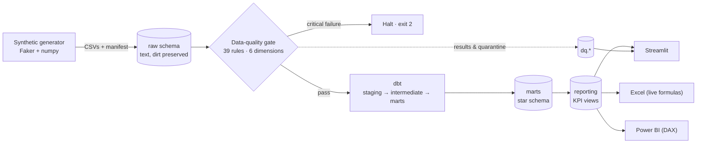
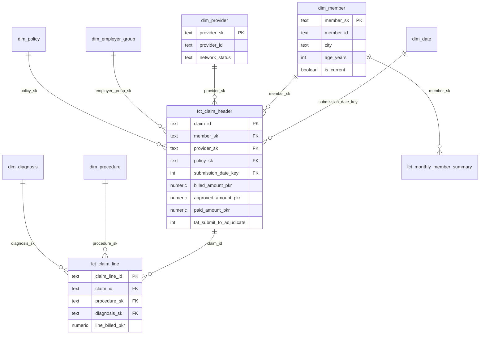
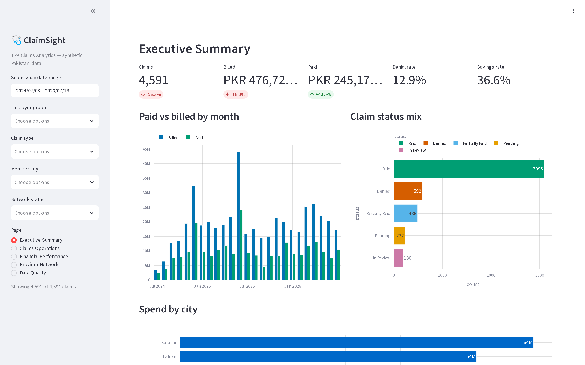
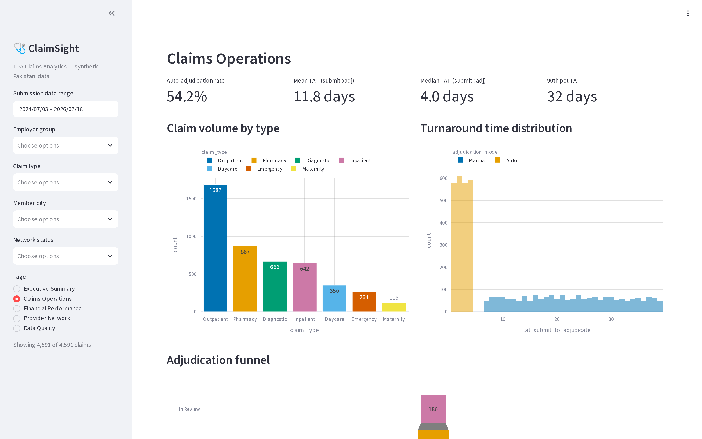
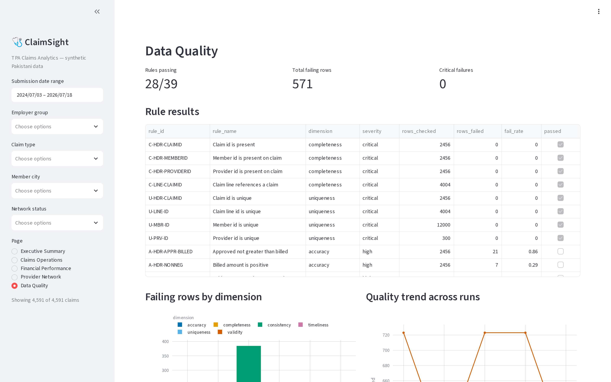

# ClaimSight — Healthcare TPA Claims Analytics & BI Platform

ClaimSight is a production-shaped analytics platform for a Pakistani healthcare
**Third Party Administrator (TPA)**. A TPA sits between employers, insurers,
members and hospitals: it receives claims, adjudicates them against policy
benefit rules, and pays or denies them. ClaimSight turns that claim stream into
the analytics that actually matter to a reporting team — **cost, utilisation,
turnaround time, denial patterns, provider behaviour and fraud signals** — end
to end, from synthetic data generation through a governed warehouse to live
dashboards and a Power BI handoff.

It is built for a **Reporting Engineer** workflow: reproducible data, a real
data-quality gate, a Kimball star schema in dbt, one shared semantic layer, and
three consumption surfaces (Streamlit, Excel, Power BI).

> **All data is synthetic.** No real patient information is present. Member names
> are generated; CNIC-style identifiers are masked (`NNNNN-*******-N`).

## Architecture



## Star schema



## Screenshots

_Placeholders — export from Streamlit / Power BI into `docs/screenshots/`._

| Executive | Operations | Data Quality |
|-----------|------------|--------------|
|  |  |  |

## Quickstart (Windows 11 / PowerShell)

```powershell
# 1. Clone and enter
git clone <your-repo-url> ClaimSight
cd ClaimSight

# 2. Start PostgreSQL 16 (Docker Desktop; host port 5433)
docker compose up -d

# 3. Python environment
python -m venv .venv
.\.venv\Scripts\python.exe -m pip install --upgrade pip
.\.venv\Scripts\python.exe -m pip install -r requirements.txt
Copy-Item .env.example .env

# 4. Run the full pipeline (generate → ingest → DQ gate → dbt → reporting → excel)
.\run.ps1 pipeline      # Python steps (generate, ingest, DQ gate, excel)
.\run.ps1 dbt           # build the star schema + run all dbt tests
.\run.ps1 reporting     # build the reporting views

# 5. Launch the dashboard
.\run.ps1 dashboard     # http://localhost:8501

# Tests & lint
.\run.ps1 test
.\run.ps1 lint
```

`run.ps1` wraps every task; a `Makefile` mirrors it for Linux/CI.

## KPI catalogue

| Area | KPIs | View |
|------|------|------|
| Financial | billed/approved/paid, approval rate, savings rate, member share, **loss ratio**, **MLR by group**, **PMPM**, IBNR | `v_financial_monthly`, `v_mlr_by_group`, `v_pmpm` |
| Operational | volume, **turnaround (mean/median/p90)**, auto-adjudication rate, **denial rate & reasons**, ageing buckets | `v_operations_monthly`, `v_denial_reasons`, `v_claims_ageing` |
| Clinical | utilisation/1,000, avg length of stay, top diagnoses & procedures, readmission proxy | `v_utilisation`, `v_top_diagnoses`, `v_top_procedures`, `v_readmissions` |
| Network | in vs out-of-network cost, provider concentration, provider scorecard | `v_network_cost_diff`, `v_provider_concentration`, `v_provider_scorecard` |
| Risk / fraud | duplicate candidates, provider billing anomalies (z-score), high-frequency members | `v_duplicate_candidates`, `v_provider_anomaly`, `v_high_frequency_members` |

Full formulas: [`docs/kpi_definitions.md`](docs/kpi_definitions.md).
40+ DAX measures: [`docs/dax_measures.md`](docs/dax_measures.md).

## Data quality: injected vs caught

The generator plants a **measured** number of defects (recorded in
`data/raw/manifest.json`); the engine's 39 rules catch them and the test-suite
reconciles the two. See [`docs/data_quality_rules.md`](docs/data_quality_rules.md).

| Defect class | Injected (manifest) | Caught by rule | Reconciliation |
|--------------|---------------------|----------------|----------------|
| Duplicate claims | `duplicate_claims` | `U-HDR-BIZDUP` | ≥ |
| Null adjudication mode | `null_values` | `C-HDR-ADJMODE` | = |
| Orphan member / provider FK | `orphan_fk_*` | `R-HDR-*-FK` | = |
| Discharge before admission | `date_violations` | `K-HDR-DISCHARGE` | = |
| approved>billed / paid>approved | `amount_violations` | `A-HDR-APPR-BILLED`, `A-HDR-PAID-APPR` | ≥ |
| Negative / zero amounts | `nonpositive_amounts` | `A-HDR-NONNEG` | = |
| Impossible ages | `impossible_ages` | `V-MBR-AGE` | = |
| Inconsistent city casing | `city_casing_variants` | `K-*-CITY` | ≥ |
| Mixed date formats | `mixed_date_format_values` | parsed in staging; `V-HDR-DATEPARSE` green | handled |

## Tech stack

Python 3.11+ · PostgreSQL 16 (Docker) · pandas · numpy · SQLAlchemy ·
psycopg2 · Faker · pydantic · **dbt-core / dbt-postgres** · Streamlit · Plotly ·
openpyxl · pytest · ruff · GitHub Actions.

## Project structure

```
claimsight/
├── docker-compose.yml        PostgreSQL 16
├── run.ps1 / Makefile        task runners
├── requirements.txt
├── src/claimsight/
│   ├── config.py  db.py  pipeline.py
│   ├── generate/            synthetic data + defect manifest
│   ├── ingest/              CSV → raw schema (dirt preserved)
│   ├── quality/             declarative DQ engine (39 rules)
│   ├── reporting/           reporting-view builder + SQL
│   └── export/              Excel report (live formulas)
├── dbt/claimsight_dw/        staging / intermediate / marts + tests
├── dashboard/app.py          Streamlit (5 pages)
├── docs/                     KPI, DAX, Power BI, data dictionary, DQ rules
└── tests/                    pytest (unit + DB integration)
```

## Notes on data authenticity

Amounts are plausible in **PKR**, cities are Pakistani, and the data carries
genuine signal (winter respiratory seasonality, out-of-network cost premium,
~5 anomalous providers, heavy-utiliser long tail, tier-linked approval rates) so
the dashboards show something worth reading. It remains entirely synthetic.

## License

MIT — see [LICENSE](LICENSE).
