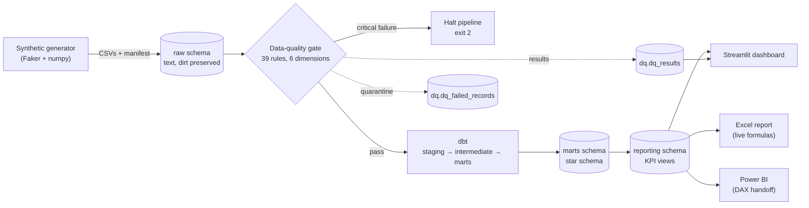

# ClaimSight Architecture

ClaimSight is a production-shaped analytics stack over synthetic Pakistani TPA
claims data. Data flows one way, left to right, with a hard data-quality gate in
the middle.

## Layers

- **Generation** (`src/claimsight/generate`) — reproducible, signal-rich,
  deliberately-imperfect data; a JSON manifest records every injected defect.
- **Ingestion** (`src/claimsight/ingest`) — loads CSVs as **text** into the
  `raw` schema so no dirt is lost before the quality engine sees it.
- **Data quality** (`src/claimsight/quality`) — a declarative rule engine over
  six dimensions (completeness, validity, consistency, uniqueness, accuracy,
  timeliness). Writes results + quarantine, scores by severity, and **halts on
  any critical failure**.
- **Warehouse** (`dbt/claimsight_dw`) — Kimball star schema. `staging` (views)
  types and canonicalises; `intermediate` (ephemeral) de-duplicates and drops
  every injected defect class; `marts` (tables) are the dimensions and facts.
- **Reporting** (`src/claimsight/reporting`) — SQL views, one definition per KPI,
  shared by every consumer.
- **Consumption** — Streamlit (live app), Excel (openpyxl with real formulas),
  Power BI (DAX + build guide).

## Design choices

- **Text-first raw layer.** Casting happens in dbt staging, so the quality
  engine can measure raw dirt (mixed date formats, bad casing) faithfully.
- **DQ engine gates; dbt cleans.** The quality engine is a *measurement and gate*
  mechanism (quarantine for visibility). dbt independently cleans, so the two are
  decoupled — the standard separation of concerns.
- **Critical vs non-critical.** Structural invariants clean data always satisfies
  (PK uniqueness, key presence) are *critical* and normally pass; the injected
  defects are *high/medium/low* and are caught, quarantined and reported without
  halting the demo. A genuine critical breach exits non-zero (tested).
- **Windows-first.** Postgres runs in Docker on host port **5433**; all Python
  uses `pathlib`; a `run.ps1` mirrors the `Makefile`.
